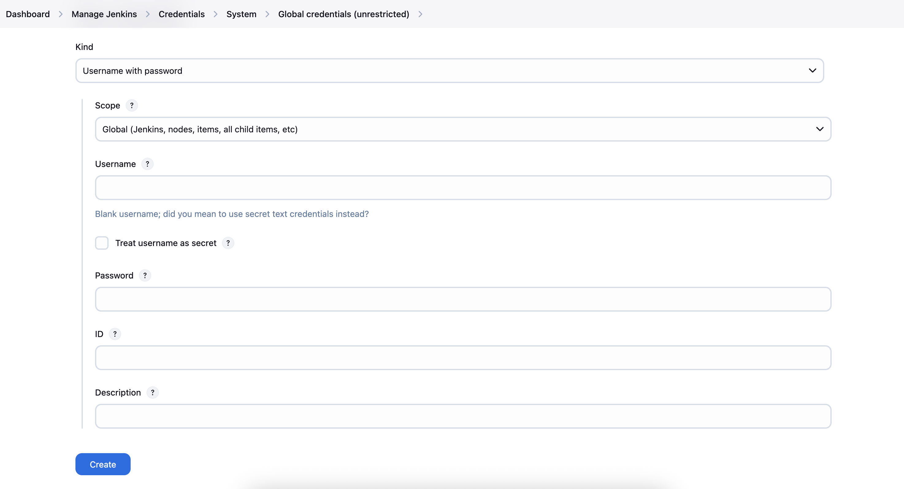
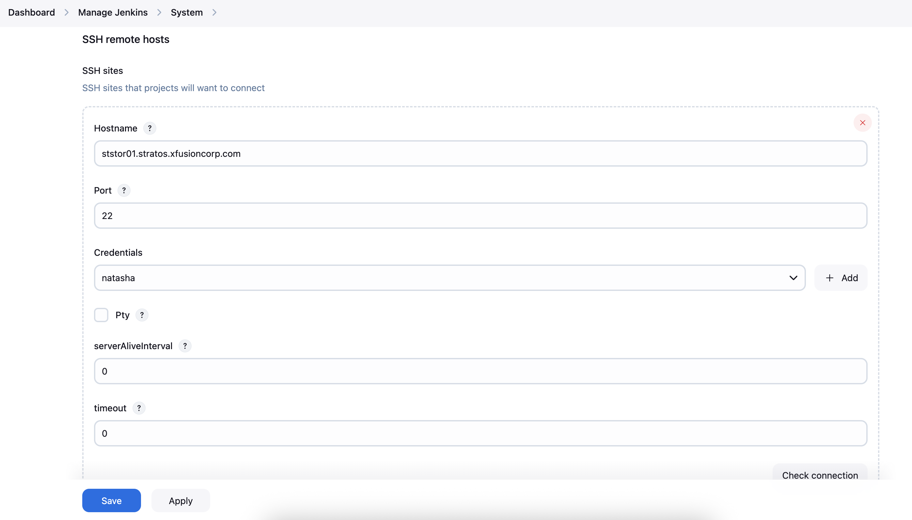
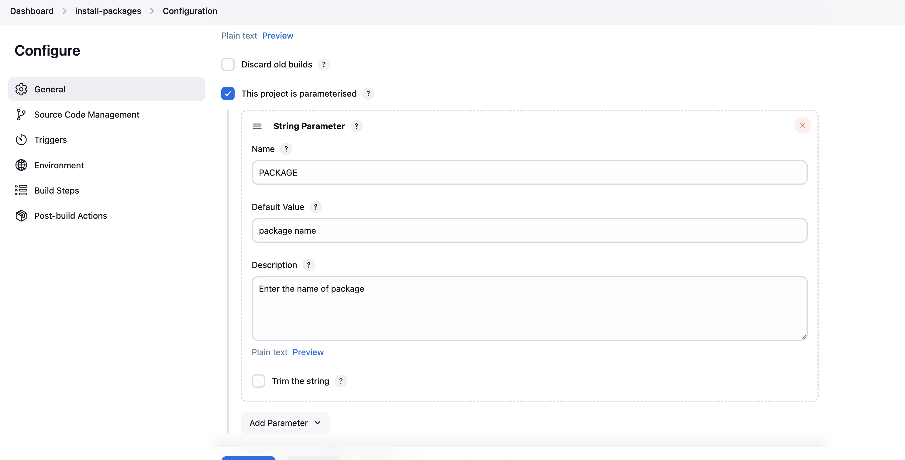
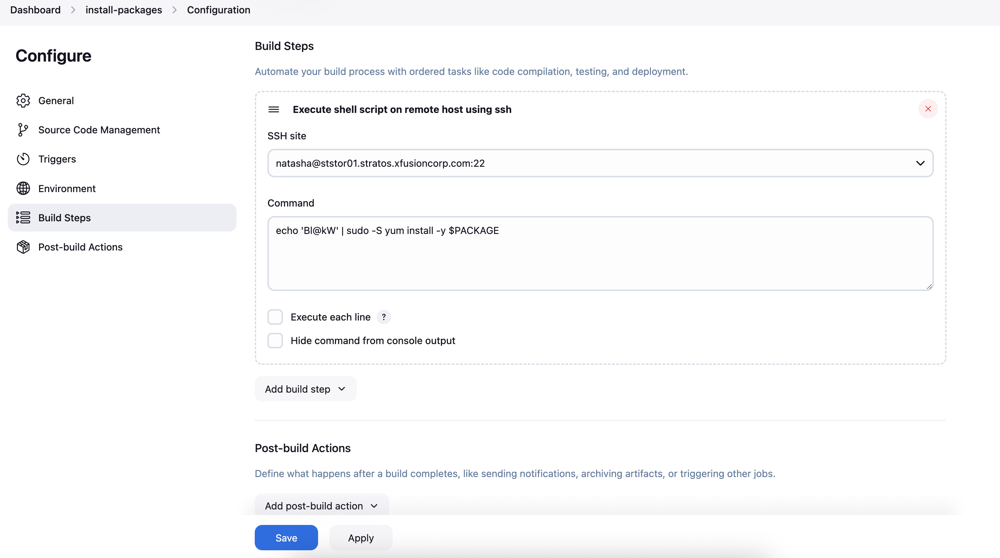
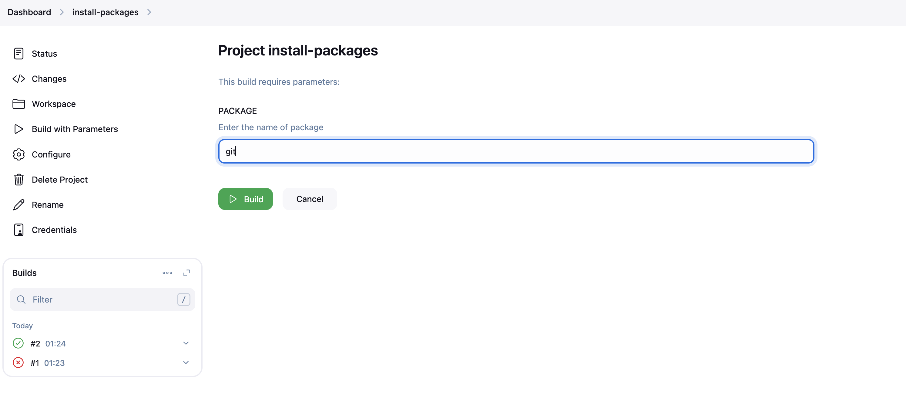
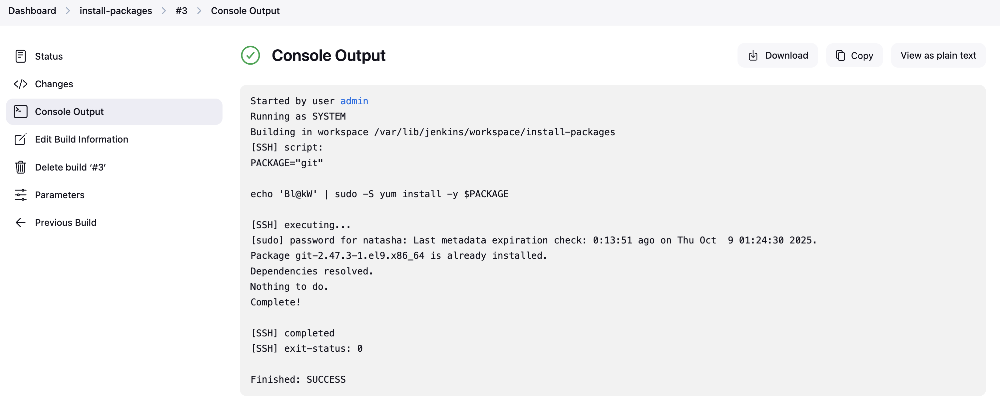

# Configure Jenkins Job for Package Installation

Some new requirements have come up to install and configure some packages on the Nautilus infrastructure under Stratos Datacenter. The Nautilus DevOps team installed and configured a new Jenkins server so they wanted to create a Jenkins job to automate this task. Find below more details and complete the task accordingly:

1. Access the Jenkins UI by clicking on the Jenkins button in the top bar. Log in using the credentials: username `admin` and password `Adm!n321`.

2. Create a new Jenkins job named `install-packages` and configure it with the following specifications:

    - Add a string parameter named `PACKAGE`.
    - Configure the job to install a package specified in the `$PACKAGE` parameter on the **`storage server`** within the `Stratos Datacenter`.

Note:

1. Ensure to install any required plugins and restart the Jenkins service if necessary. Opt for `Restart Jenkins when installation is complete and no jobs are running` on the plugin installation/update page. Refresh the UI page if needed after restarting the service.

2. Verify that the Jenkins job runs successfully on repeated executions to ensure reliability.

3. Capture screenshots of your configuration for documentation and review purposes. Alternatively, use screen recording software like loom.com for comprehensive documentation and sharing.

## Steps

0. Update Plugins and Restart

1. Let's install the following plugins

    - SSH
    - SSH Credentials
    - SSH Build Agent

2. Find the Nautilus Storage Server Details from [this page](https://kodekloudhub.github.io/kodekloud-engineer/docs/projects/nautilus#infrastructure-details)

3. Go to Manage Jenkins > Credentials > System > Global credentials and Add credentials

4. Go to Manage Jenkins > System  and Add SSH sites under SSH remote Posts

5. Create a freestyle job `install-packages` with following configs

    - Add Parameter "PACKAGE"
    

    - Build Steps
    Choose `Execute shell script on remote host using ssh`
    

    - Apply and Save

6. To execute: Dashboard > install-packages > Build with Parameters

    

    - Execute
    

## Good to Know?

### Jenkins Remote Execution

- **SSH Plugin**: Execute commands on remote servers via SSH
- **Credentials Management**: Secure storage of SSH credentials
- **Remote Hosts**: Configure target servers for execution
- **Parameterized Jobs**: Dynamic job configuration with parameters

### SSH Configuration

- **Host Key Verification**: Disable for automation (security consideration)
- **Authentication**: Username/password or SSH key-based
- **Connection Pooling**: Reuse SSH connections for efficiency
- **Timeout Settings**: Configure connection and execution timeouts

### Package Management Automation

- **Remote Installation**: Install packages on multiple servers
- **Idempotent Operations**: Safe to run multiple times
- **Error Handling**: Proper error reporting and handling
- **Logging**: Capture installation logs for troubleshooting

### Best Practices

- **Credential Security**: Use Jenkins credential store
- **Parameter Validation**: Validate user inputs
- **Error Recovery**: Handle network and execution failures
- **Audit Trail**: Log all remote operations
