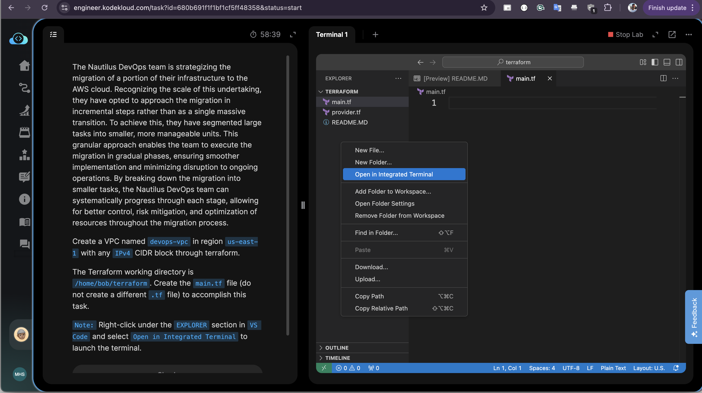
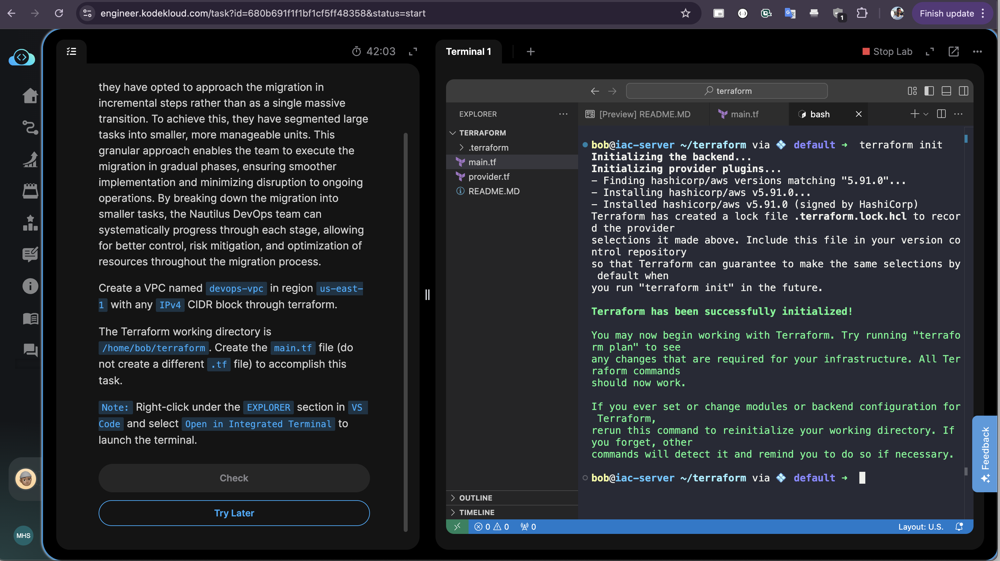
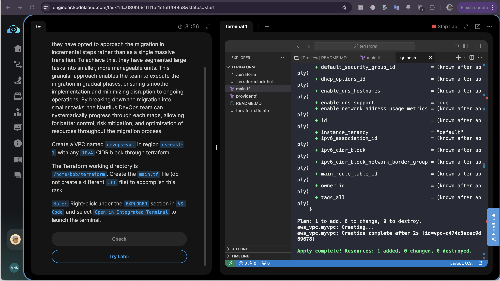

# Create VPC Using Terraform

The Nautilus DevOps team is strategizing the migration of a portion of their infrastructure to the AWS cloud. Recognizing the scale of this undertaking, they have opted to approach the migration in incremental steps rather than as a single massive transition. To achieve this, they have segmented large tasks into smaller, more manageable units. This granular approach enables the team to execute the migration in gradual phases, ensuring smoother implementation and minimizing disruption to ongoing operations. By breaking down the migration into smaller tasks, the Nautilus DevOps team can systematically progress through each stage, allowing for better control, risk mitigation, and optimization of resources throughout the migration process.

- Create a VPC named `devops-vpc` in region `us-east-1` with any `IPv4 CIDR` block through terraform.

- The Terraform working directory is `/home/bob/terraform`. Create the `main.tf` file (do not create a different .tf file) to accomplish this task.

> Note: Right-click under the EXPLORER section in VS Code and select Open in Integrated Terminal to launch the terminal.

## Steps

1. Create the main.tf file in editor and copy paste the resource block

    ```hcl
    resource "aws_vpc" "myvpc" {
        cidr_block = "10.0.0.0/16"

        tags = {
            Name = "devops-vpc"
        }
    }
    ```

    > It will create the aws vpc

2. Open the terminal and run the following commands:

    > right click on the sidebar of editor and open terminal

    

    ```sh
    terraform init
    terraform plan
    terraform apply -auto-approve
    ```

    > `init`: Initialize the project, download required plugins, modules, etc.

    

    > `plan`: To print the changes that will apply
    > `apply`: To create the vpc using terraform

    

3. Verify result:

    ```sh
    terraform state list
    ```

## Reference

- [Offical Documentation](https://registry.terraform.io/providers/hashicorp/aws/latest/docs/resources/vpc)
- [CIDR Calculator](https://mxtoolbox.com/subnetcalculator.aspx)

## Good to Know

- **Terraform State**: Terraform maintains state in `terraform.tfstate` file to track resource mappings
- **CIDR Blocks**: `/16` provides 65,536 IP addresses (10.0.0.0 to 10.0.255.255)
- **VPC Naming**: Use `tags` block to set the Name tag: `tags = { Name = "devops-vpc" }`
- **Provider Configuration**: AWS provider is automatically inferred from resource usage
- **Resource Naming**: Terraform resource names (like `myvpc`) are internal identifiers, not AWS names
- **State Management**: Use `terraform destroy` to clean up resources when no longer needed
